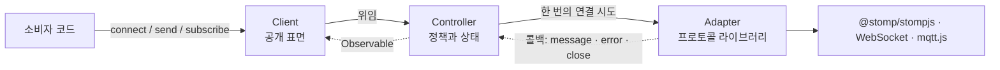
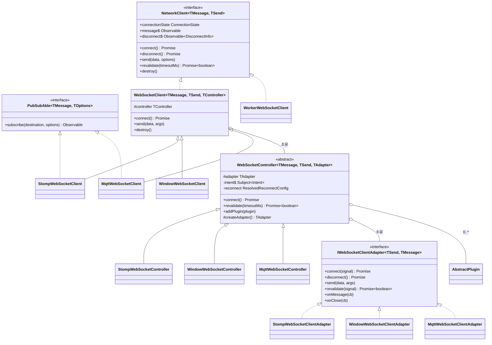
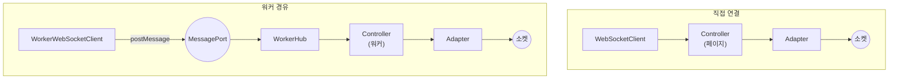
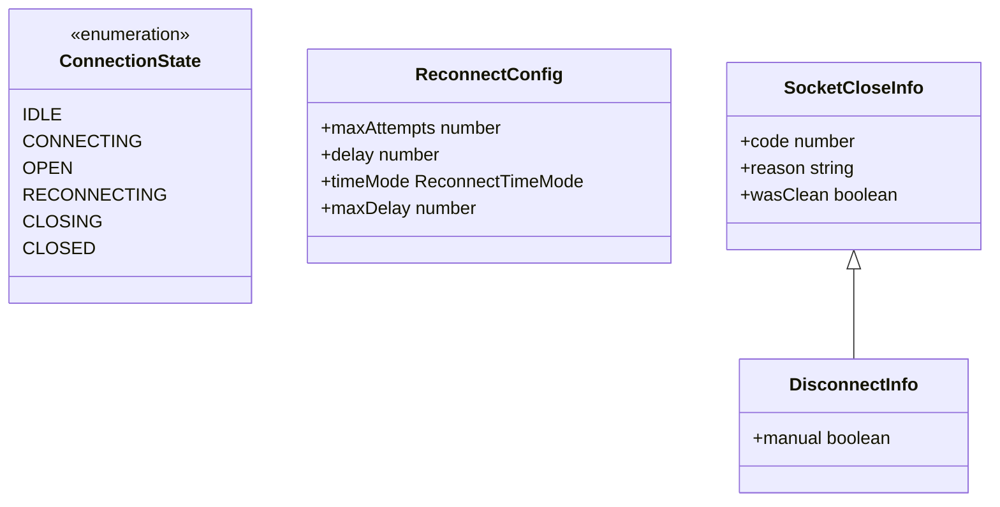
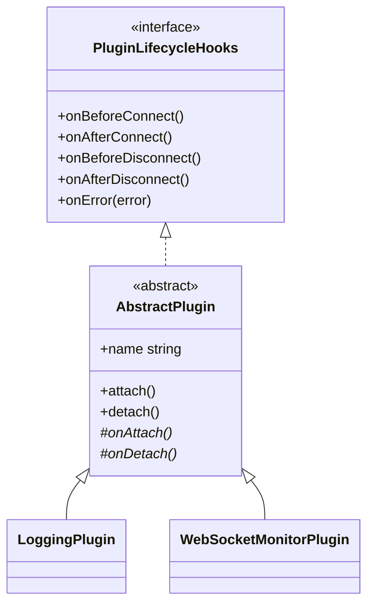

# 구조와 클래스 관계

이 문서는 "무엇이 무엇을 소유하는가"를 설명한다. 동작 순서는 [연결 수명](lifecycle.md),
워커 경로는 [워커](worker.md) 문서에 있다.

## 세 계층

각 계층이 아는 것과 모르는 것이 규칙이다.

| 계층 | 소유 | 모르는 것 |
| --- | --- | --- |
| Client | 공개 API 표면 | Adapter 의 존재 |
| Controller | ConnectionState, 재연결 정책, 플러그인, 스트림 | 어떤 라이브러리를 쓰는지 (구체 Adapter 는 서브클래스만 안다) |
| Adapter | 소켓 하나, 프로토콜 라이브러리 | 재연결, 상태 기계 |

**Adapter 는 재시도하지 않는다.** "한 번 시도해서 성공/실패"만 책임진다. 재시도를 어댑터에 두면
프로토콜마다 정책이 갈리고, 정책을 바꾸려면 세 곳을 고쳐야 한다.

## 클래스 관계

프로토콜 한 줄이 세 클래스로 이어진다.

| 프로토콜 | Client | Controller | Adapter |
| --- | --- | --- | --- |
| STOMP | `StompWebSocketClient` | `StompWebSocketController` | `StompWebSocketClientAdapter` |
| 순수 WebSocket | `WindowWebSocketClient` | `WindowWebSocketController` | `WindowWebSocketClientAdapter` |
| MQTT | `MqttWebSocketClient` | `MqttWebSocketController` | `MqttWebSocketClientAdapter` |

## 제네릭이 하는 일

`WebSocketController<TMessage, TSend, TAdapter>` 의 세 번째 인자는 **구체 Adapter 타입**이다.
서브클래스가 프로토콜 전용 메서드(예: STOMP `subscribe`)를 캐스팅 없이 부르기 위해 좁혀 쓴다.
기반 클래스는 인터페이스만 본다.

`SendArgs<TSend>` 는 `send()` 의 두 번째 인자를 프로토콜별로 다르게 만든다. `undefined` 면 인자
하나(`send(text)`), 그 외에는 옵션이 필수(`send(text, { destination })`)다. 순수 WebSocket 에
destination 을 넘기는 코드는 타입에서 걸린다.

## NetworkClient

직접 연결과 워커 경유는 **상태 기계를 다른 곳에 둔다**. 그래서 상속이 아니라 인터페이스로 묶는다.

`WorkerWebSocketClient` 가 `WebSocketClient` 를 상속했다면 페이지에도 Controller 가 생겨
상태 소유자가 둘이 된다 — 워커는 재연결 중인데 페이지는 자기 계산으로 "연결됨"이라 믿는 어긋남이 생긴다.

한 가지 예외는 **전용 Worker**다. 한 페이지가 한 연결을 소유하므로 `RemoteAdapter implements
IWebSocketClientAdapter` 를 두고 Controller 를 페이지에 남기는 구성이 성립한다. SharedWorker
에서는 탭마다 재연결 정책이 따로 돌고 한 탭의 `disconnect()` 가 공유 소켓을 닫으므로 성립하지 않는다.
그래서 지금은 만들지 않았다.

## 공통 타입

`ConnectionState` 를 문자열 열거형으로 둔 이유는 브라우저 `readyState`(0~3)나 stompjs 의
`ActivationState` 와 **절대 섞이지 않게** 하기 위해서다. 숫자였다면 실수로 비교돼도 타입이 통과한다.

`CLOSING` 은 현재 Controller 가 쓰지 않는다. 종료는 로컬 결정이라 즉시 `IDLE` 로 간다 — 브로커
응답을 기다리는 중간 상태를 두면, 응답이 오지 않을 때 그 상태에 갇힌다([근거](lifecycle.md#종료)).

## 플러그인

Controller 는 훅 이름만 보고 부른다. 클래스를 확인하지 않는다 — 확인하는 순간 사용자가 만든
플러그인은 훅을 못 받고, 확장점이라는 말이 거짓이 된다.
