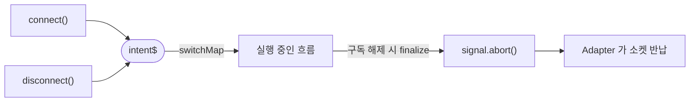
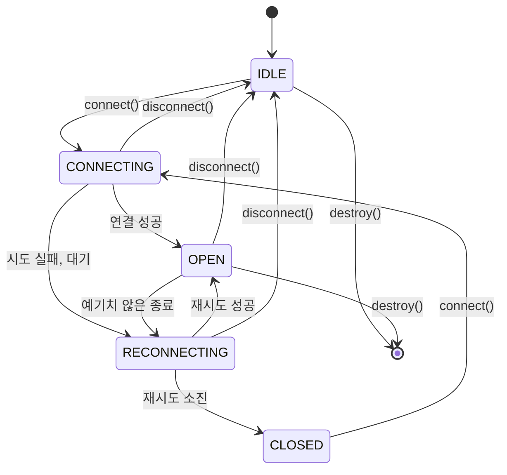
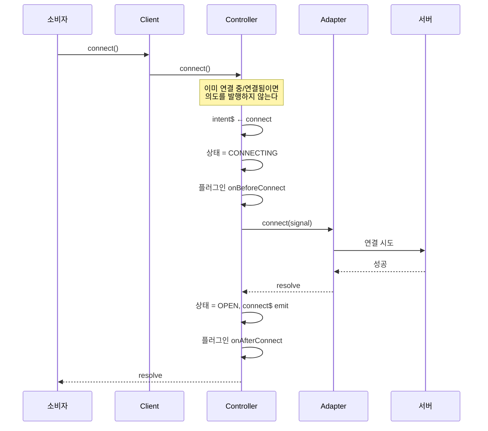
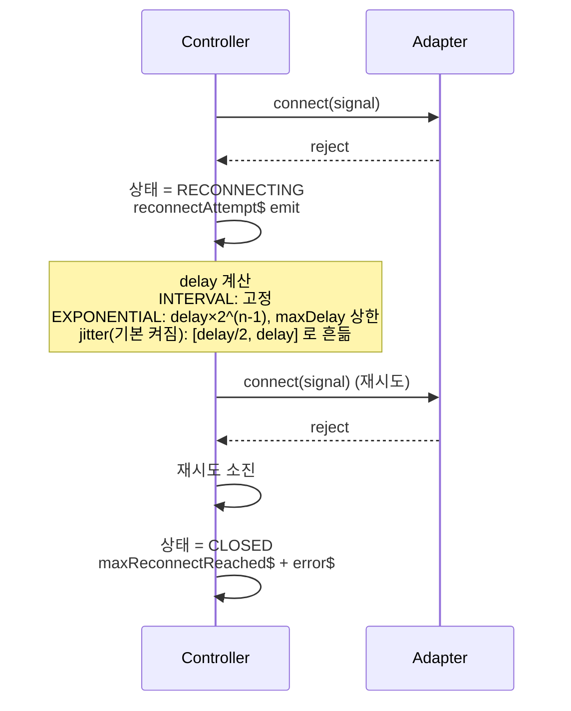
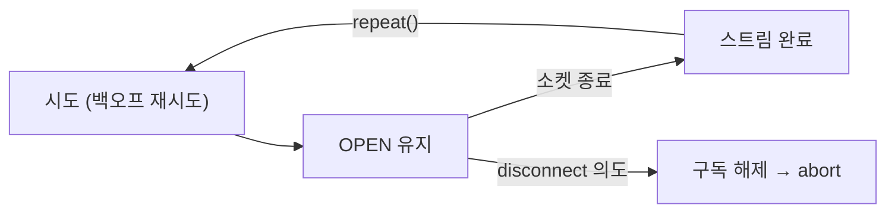
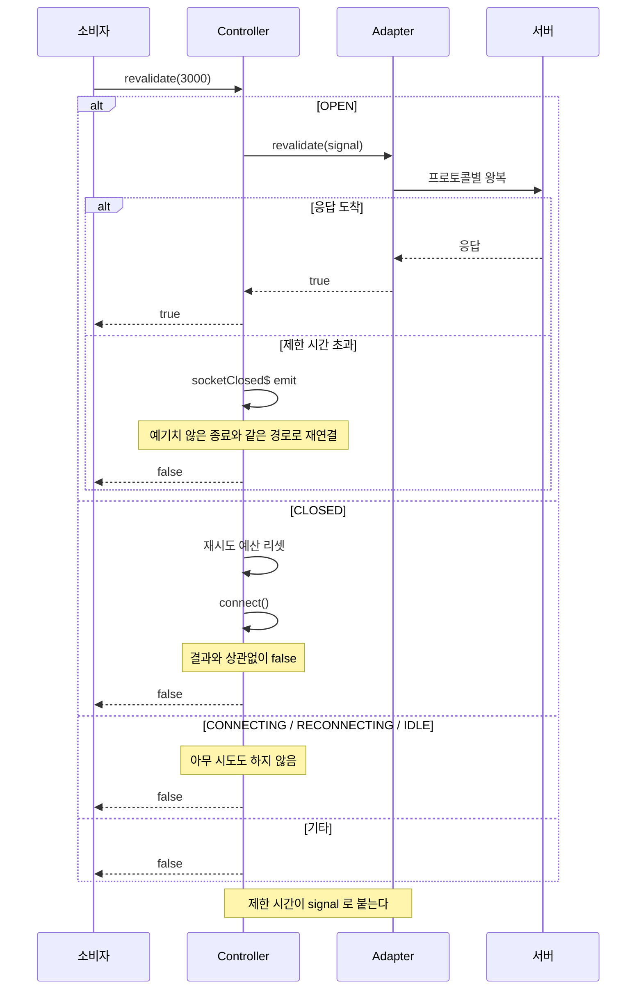
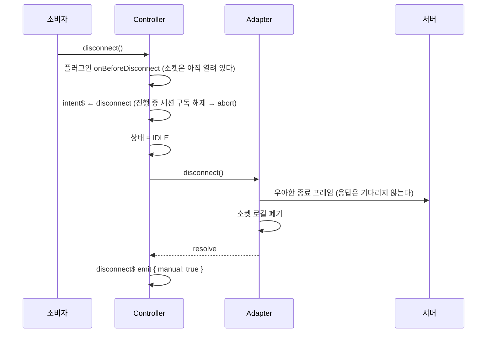
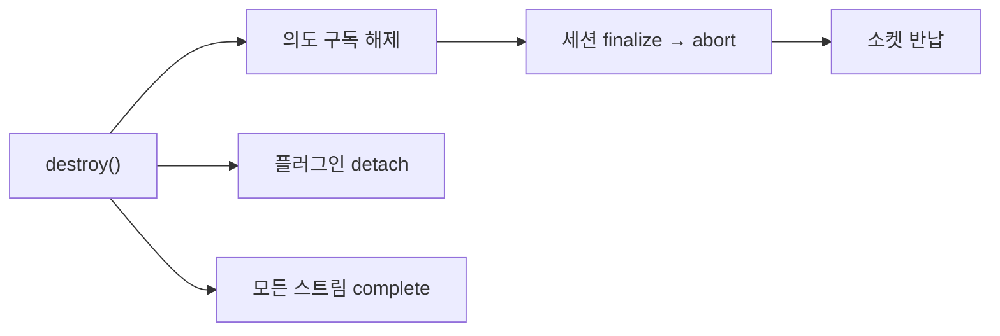

# 연결 수명

연결 하나의 수명을 누가 소유하고, 어떤 순서로 움직이는지. 계층 구조는
[구조와 클래스 관계](architecture.md)에 있다.

## 규칙 두 개

수명 관리는 이 둘로 전부 설명된다.

1. **의도는 스트림으로 직렬화한다.** `connect`/`disconnect` 는 명령이 아니라 의도이고,
   `Subject<Intent>` 에 실려 `switchMap` 으로 처리된다 — 새 의도가 들어오면 이전 흐름은 구독 해제된다.
   "지금 종료 중인가" 같은 플래그를 따로 들지 않는다.
2. **연결의 수명은 AbortSignal 하나다.** 흐름이 구독 해제되면 `finalize` 가 abort 하고, 어댑터는
   그 신호만 보고 — 시도 중이든 이미 열렸든 — 소켓을 놓는다.



## 상태



`CLOSING` 은 쓰지 않는다. 이유는 [종료](#종료) 절에 있다.

## 연결



**이미 연결된 상태에서 `connect()` 를 불러도 의도를 발행하지 않는다.** 발행하면 `switchMap` 이
살아 있는 세션을 대체하고, 그 세션의 `finalize` 가 소켓을 놓아 버린다 — 아무것도 바꾸지 않는 의도가
연결을 끊는 셈이 된다. 실제로 SharedWorker 에서 두 번째 탭이 붙는 순간 첫 탭의 소켓이 끊기는
증상으로 드러났던 결함이다.

## 재시도



`maxAttempts` 는 **첫 시도를 제외한** 횟수다. 총 시도는 `1 + maxAttempts`.

지연에는 equal jitter 가 기본으로 붙는다 — 계산된 값의 `[절반, 전부]` 사이를 뽑는다. 서버가 죽으면
클라이언트들이 같은 순간에 재시도해서(실측 5ms 이내) 되살아나는 서버를 다시 눕히기 때문이다.
`maxAttempts` 에서 포기하는 구조라 재시도 예산이 시간 창이고, full jitter 는 그 창을 평균 절반으로
줄여 버린다. 그래서 창의 75% 를 지키는 equal jitter 를 쓴다. `reconnect.jitter: false` 로 끈다.

각 시도의 원인 에러는 어댑터 콜백으로 이미 `error$` 에 나갔으므로, 소진 시점에는 "재시도 소진"이라는
별개 사건 하나만 더 알린다. 같은 에러를 두 번 흘리지 않는다.

## 예기치 않은 종료

연결이 살아 있는 동안 세션 스트림은 열려 있고, 소켓이 닫히면 완료된다. `repeat()` 가 그 완료를 받아
같은 정책으로 다시 시도한다 — 재연결 경로가 최초 연결과 하나로 유지된다.



STOMP 구독과 MQTT 구독은 어댑터가 기억하고 있다가 재연결 후 자동으로 다시 건다. 소비자가 만든
Observable 은 그대로 살아 있으므로 다시 구독할 필요가 없다.

## revalidate

하트비트는 간격만큼 늦게 알아챈다. `revalidate()` 는 **지금 확인**한다.



| 프로토콜 | 왕복 수단 | 진짜 왕복인가 |
| --- | --- | --- |
| STOMP | `revalidateDestination` 에 잠깐 SUBSCRIBE + `receipt` → RECEIPT 수신 → 해제 | 예 |
| MQTT | 아무도 구독하지 않는 토픽에 QoS 1 발행 → PUBACK | 예 |
| 순수 WebSocket (하트비트 설정 시) | 약속된 ping 을 보내고 응답 대기 | 예 |
| 순수 WebSocket (설정 없음) | `readyState` 확인 | **아니오** — half-open 은 못 잡는다 |

STOMP 는 `revalidateDestination` 이 없으면 왕복하지 않는다. 유효한 destination 규칙이 브로커마다
달라서(RabbitMQ `/topic/...`, 다른 브로커는 `/queue/...`) 라이브러리가 이름을 지어내지 않는다.

> 첫 구현은 존재하지 않는 구독의 UNSUBSCRIBE 에 receipt 를 달았다. 브로커는 모르는 id 에 RECEIPT 를
> 주지 않으므로 항상 실패했고, 기기 점검에서 STOMP 세 조합이 전부 "죽음"으로 보고되면서 드러났다.

## send

`send()` 는 큐잉하지 않고 OPEN 에서만 즉시 전송한다. 그 외에는 throw 한다.

| 상태 | 에러 메시지 |
| --- | --- |
| IDLE | `[클래스명] cannot send: connection is IDLE` |
| CONNECTING | `[클래스명] cannot send: connection is CONNECTING` |
| RECONNECTING | `[클래스명] cannot send: connection is RECONNECTING` |
| CLOSED | `[클래스명] cannot send: connection is CLOSED` |
| destroyed | `[클래스명] cannot send: controller has been destroyed` |

라이브러리는 전송의 유효 기간, 중복 제거 규칙, 사용자 의도를 모르므로 보관 정책을 만들 수 없다.
그래서 메시지 보류는 앱이 책임지고, `connect$` 시점에 `send` 재시도 큐를 비운다.

```ts
const pending: string[] = [];

client.connect$.subscribe(() => {
  while (pending.length > 0) {
    try {
      client.send(pending.shift()!);
    } catch {
      break;
    }
  }
});

function safeSend(body: string) {
  try {
    client.send(body);
  } catch (error) {
    pending.push(body);
  }
}
```

## 종료



**종료는 로컬 결정이다.** 브로커의 종료 확인(RECEIPT, close 프레임)을 기다리면, 그 확인은 상대와
네트워크에 달려 있어 도착 보장이 없다. 기다리는 순간 "끊는다"는 결정이 상대에게 인질로 잡힌다.

그래서 어댑터의 반납은 두 단계다.

1. 우아한 종료 프레임을 **보낸다**(STOMP DISCONNECT, MQTT DISCONNECT). 응답은 await 하지 않는다.
2. 소켓 핸들을 **즉시 폐기한다**. 상대와 무관하게 유한 시간에 끝나므로 이 완료를 "끊겼다"의 기준으로 삼는다.

`WebSocket.close()` 는 버퍼에 남은 데이터를 먼저 내보내므로, 1번 직후에 폐기해도 프레임은 나간다.

> 이 규칙이 없던 때에는 네트워크가 끊긴 상태에서 "해제"를 누르면 `CLOSING` 에서 영원히 멈췄고,
> 그 상태에서는 `connect()` 도 무시돼 방 하나가 통째로 조작 불가가 됐다.

## 폐기



두 번 불러도 안전하다. 폐기 후 `connect()` 는 조용히 무시되지 않고 **거부**된다 — 살아 있다고 착각한
채 기다리는 호출자를 만들지 않기 위해서다.
