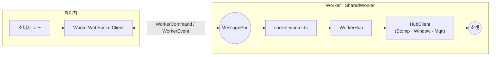
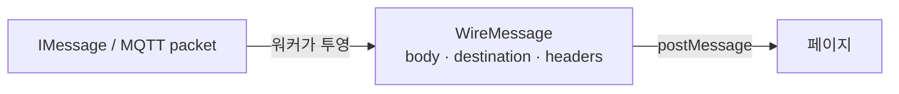
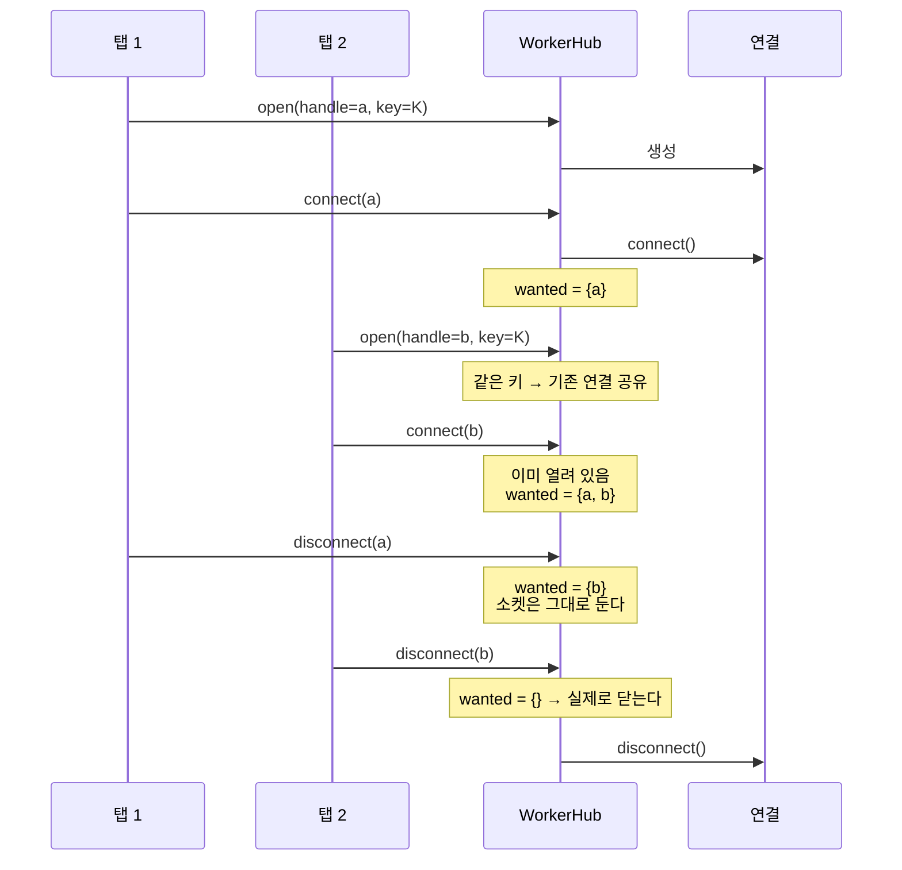
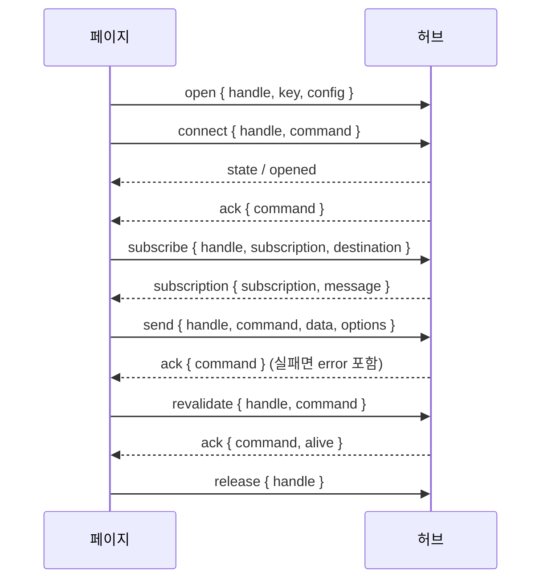
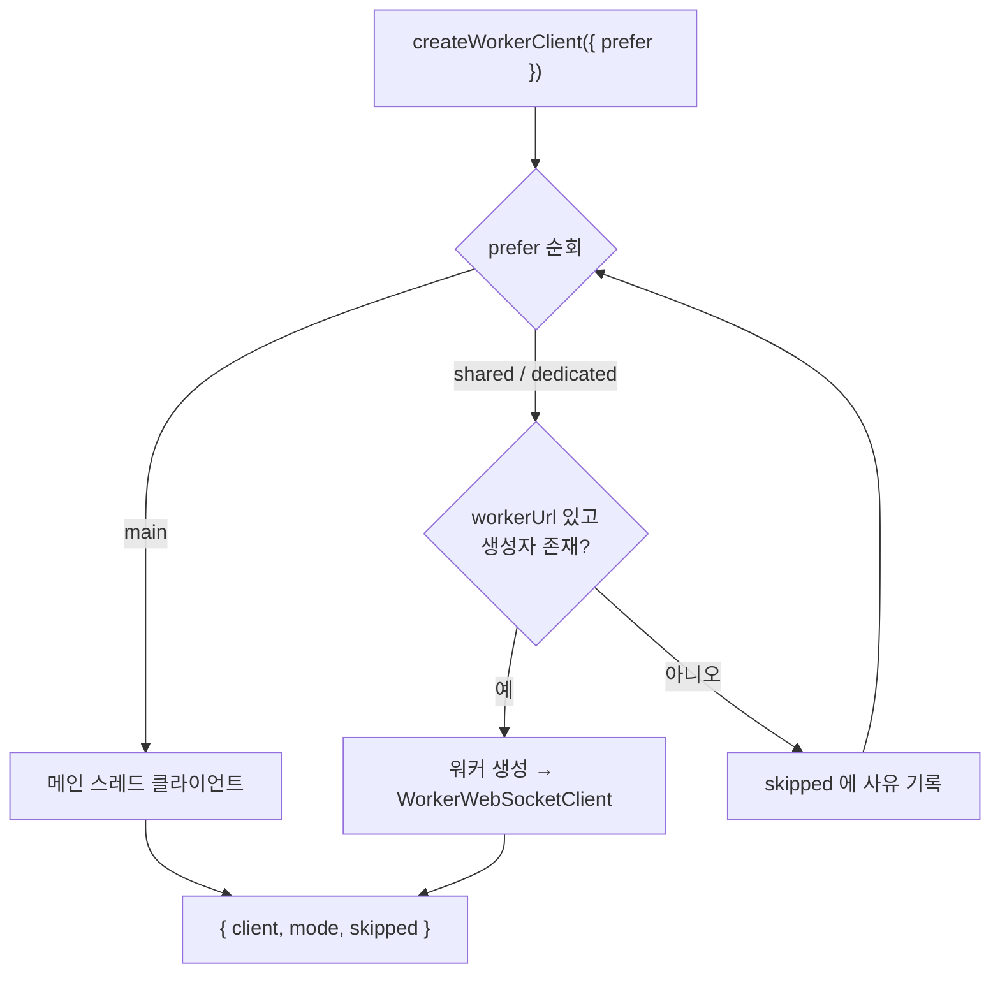

# 워커

소켓을 페이지 밖에서 소유하는 경로. 계층은 [구조](architecture.md), 상태 규칙은
[연결 수명](lifecycle.md)에 있다.

## 무엇이 달라지는가

| 모드 | 소켓 소유자 | 탭 2개일 때 | 쓰는 이유 |
| --- | --- | --- | --- |
| `main` | 페이지(메인 스레드) | 방당 소켓 2개 | 가장 단순. 워커 번들링이 필요 없다 |
| `dedicated` | 이 탭 전용 Worker | 방당 소켓 2개 | 소켓 작업이 메인 스레드에서 빠진다 |
| `shared` | SharedWorker | **방당 소켓 1개** | 탭이 늘어도 브로커 연결과 재연결이 늘지 않는다 |

`shared`/`dedicated` 는 플랫폼 용어 그대로다(`SharedWorkerGlobalScope`,
`DedicatedWorkerGlobalScope`). `main` 은 워커를 쓰지 않는 경우다.

## 조각들



| 파일 | 역할 |
| --- | --- |
| `worker/protocol.ts` | 페이지 ↔ 워커 메시지 계약 |
| `worker/socket-worker.ts` | 진입점. 전용 Worker 와 SharedWorker 를 한 파일로 다룬다 |
| `worker/hub.ts` | 워커 안에서 연결을 소유. 키로 공유하고 참조를 센다 |
| `worker/WorkerWebSocketClient.ts` | 페이지 쪽 손잡이. `NetworkClient` 구현 |
| `worker/createWorkerClient.ts` | 쓸 수 있는 모드를 골라 만든다 |

진입점 하나가 두 생성자를 다 받는다. 전용 Worker 는 전역 자신이 포트고, SharedWorker 는
`onconnect` 로 포트를 하나씩 받는다.

```ts
// 소비자의 워커 파일
import "ws-pack/worker";
```

## 구조화 복제라는 제약

포트를 건너는 값은 전부 복제 가능해야 한다. 그래서 프로토콜 객체를 그대로 넘기지 않는다 —
stompjs `IMessage` 에는 `ack()` 함수가, MQTT 패킷에는 `Buffer` 가 들어 있다.



같은 이유로 설정에서 `client`, `plugins`, `logger` 를 뺐고, 순수 WebSocket 하트비트 설정도
문자열과 숫자만 받는다(함수였다면 워커로 넘길 때 조용히 사라진다).

## 연결 공유와 수명

같은 `key` 를 요청한 손잡이들은 연결 하나를 함께 쓴다. 그래서 `connect`/`disconnect` 는
**명령이 아니라 의사 표시**로 해석된다.



한 탭이 "해제"를 눌렀다고 다른 탭이 쓰는 소켓을 닫으면 안 된다. 마지막으로 원하는 손잡이가 사라질 때만
실제로 닫는다. 손잡이를 놓는 것(`destroy()`)도 마찬가지로 참조가 0이 될 때 연결을 정리한다.

## 명령과 이벤트



명령마다 `command` 식별자를 달아 응답을 짝짓는다. 그래서 페이지 쪽 `send()` 는 `Promise` 다 —
같은 프로세스의 클라이언트가 즉시 throw 하는 것과 다른 유일한 지점이고,
`await` 로 쓰면 두 경로가 같은 모양이 된다.

구독은 손잡이별로 관리된다. 한 탭이 구독을 풀어도 다른 탭의 구독은 살아 있고, 포트가 닫히면 그 포트가
연 손잡이와 구독이 함께 정리된다.

## 모드 선택



폴백은 자동이되 **결과를 숨기지 않는다**. 어떤 모드가 선택됐고 앞 후보를 왜 건넜는지 반환값에 담는다 —
조용히 강등되면 소비자는 탭 사이 공유가 사라진 걸 모른 채 그대로 쓴다.

```ts
const { client, mode, skipped } = createWorkerClient({ config, workerUrl });
// mode: "dedicated"
// skipped: [{ mode: "shared", reason: "이 환경에 SharedWorker 가 없다" }]
```

`supportedWorkerModes()` 는 만들지 않고 가능 여부만 답한다. 화면에서 선택지를 그릴 때 쓴다.

> Safari 는 16 부터 SharedWorker 를 지원한다. 실기기 iOS 26 점검에서 `shared` 가 선택되는 것을
> 확인했다. 폴백은 그 이전 버전과 일부 웹뷰·임베디드 브라우저를 위한 것이다.

## 눈으로 확인하기

- `/worker-check.html` — 탭 두 개를 열고 에코 서버 로그의 연결 수를 본다. SharedWorker 라면 1개다
- `/device-check.html` — 프로토콜 × 모드 전 조합을 자동으로 돌려 표로 보여준다
- 데모 상단의 `메인 스레드 · Worker · SharedWorker` 토글 — 같은 채팅을 세 방식으로 돌려 본다
